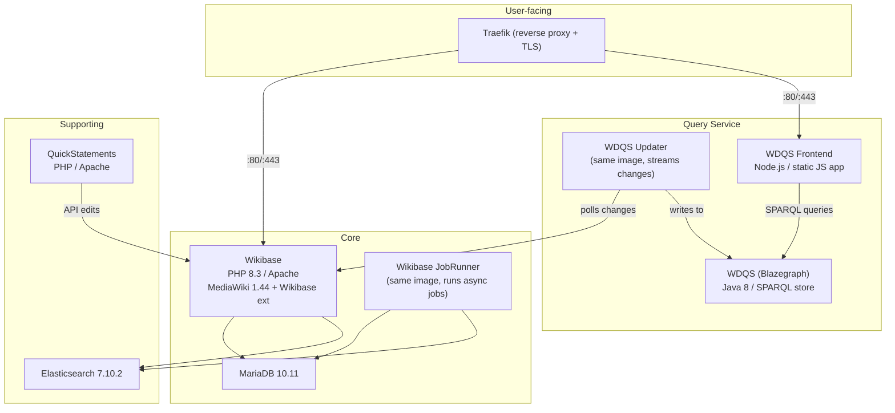

# Wikibase Suite — Component Analysis for Upsun Deployment

## Architecture Overview

Wikibase Suite is a **multi-service Docker Compose stack** of 8 containers that together form a self-hosted Wikidata-like knowledge graph. Here's the interaction diagram:

---

## Component-by-Component Breakdown

### 1. Wikibase (Core Application)

| Aspect | Detail |
|---|---|
| **Image** | `wikibase/wikibase:5` |
| **Runtime** | PHP 8.3 on Apache (Debian Bookworm) |
| **Application** | MediaWiki 1.44.0 + Wikibase extension + 11 more extensions |
| **Port** | 80 (HTTP) |
| **Persistent storage** | `/var/www/html/images` (uploaded files), `/quickstatements/data` (shared with QS) |
| **Config volume** | `/config` — LocalSettings.php, wikibase-php.ini, extension configs |
| **Database** | MariaDB via `DB_SERVER`, `DB_USER`, `DB_PASS`, `DB_NAME` env vars |
| **Elasticsearch** | Connects to `ELASTICSEARCH_HOST:9200` for CirrusSearch |

**Entrypoint behavior**: On first boot (no `LocalSettings.php`), it runs `php maintenance/install.php` to seed the database. On subsequent boots, runs `update.php --quick` to apply schema migrations.

**Key extensions bundled**: Wikibase, Babel, CLDR, CirrusSearch, Elastica, EntitySchema, OAuth, UniversalLanguageSelector, WikibaseCirrusSearch, WikibaseManifest, WikibaseEdtf, WikibaseLocalMedia.

> [!IMPORTANT]
> This is the central application. All other services depend on it being healthy.

---

### 2. Wikibase JobRunner (Background Worker)

| Aspect | Detail |
|---|---|
| **Image** | Same as Wikibase (`wikibase/wikibase:5`) |
| **Command** | [/jobrunner-entrypoint.sh](file:///Users/vincenzo/Repositories/upsun/wikibase-release-pipeline/build/wikibase/jobrunner-entrypoint.sh) |
| **What it does** | Runs `php maintenance/runJobs.php --wait` in a loop |
| **Volumes** | Shares all volumes with the Wikibase service (`volumes_from`) |
| **No HTTP port** | Pure background worker |

This is a worker process that picks up deferred MediaWiki jobs (search indexing, notification dispatch, link table updates, etc). It shares the exact same filesystem as the Wikibase container.

> [!NOTE]
> **Upsun mapping**: This naturally maps to a **worker** instance alongside the PHP app container. Upsun supports workers natively.

---

### 3. MariaDB 10.11

| Aspect | Detail |
|---|---|
| **Image** | `mariadb:10.11` |
| **Volume** | `mysql-data` → `/var/lib/mysql` |
| **Env vars** | `MYSQL_DATABASE`, `MYSQL_USER`, `MYSQL_PASSWORD`, `MYSQL_RANDOM_ROOT_PASSWORD` |

Standard MariaDB. Stores all MediaWiki/Wikibase data, user accounts, page content, and revision history.

> [!NOTE]
> **Upsun mapping**: Direct match → Upsun's managed **MariaDB service**.

---

### 4. Elasticsearch 7.10.2

| Aspect | Detail |
|---|---|
| **Image** | `wikibase/elasticsearch:1` (based on `elasticsearch:7.10.2`) |
| **Custom plugins** | `org.wikimedia.search:extra:7.10.2-wmf12`, `experimental-highlighter` |
| **Volume** | `elasticsearch-data` → `/usr/share/elasticsearch/data` |
| **Port** | 9200 |
| **Config** | `discovery.type: single-node`, 512MB heap |

Used by the CirrusSearch extension for full-text search instead of MediaWiki's default DB-based search.

> [!WARNING]
> **Upsun challenge**: Upsun provides Elasticsearch/OpenSearch as a managed service but the **Wikimedia-specific plugins** (`extra`, `experimental-highlighter`) won't be available on managed ES.

---

### 5. WDQS — Wikidata Query Service (Blazegraph)

| Aspect | Detail |
|---|---|
| **Image** | `wikibase/wdqs:2` |
| **Runtime** | Java 8 (Eclipse Temurin JRE 8) on Debian Bookworm |
| **Application** | Blazegraph SPARQL triplestore (WDQS v0.3.142) |
| **Artifact** | `service-0.3.142-dist.tar.gz` from [Wikimedia Archiva](https://archiva.wikimedia.org/repository/releases/org/wikidata/query/rdf/service/0.3.142/) |
| **Startup** | [./runBlazegraph.sh](file:///Users/vincenzo/Repositories/upsun/wikibase-release-pipeline/build/wdqs/runBlazegraph.sh) (Jetty-embedded HTTP server) |
| **Port** | 9999 |
| **Volume** | `wdqs-data` → `/wdqs/data` (triplestore journal files) |
| **Heap** | 1 GB default (`HEAP_SIZE=1g`) |
| **How it works** | Serves SPARQL queries on `/bigdata/namespace/wdq/sparql` |

This is the **SPARQL query engine** — users write SPARQL queries via the frontend and this service evaluates them against a triplestore populated by the WDQS Updater.

> [!NOTE]
> **Upsun mapping**: Upsun provides a **Java runtime**, so Blazegraph can run as a **Java app**. The build hook would download and extract the WDQS tarball, [runBlazegraph.sh](file:///Users/vincenzo/Repositories/upsun/wikibase-release-pipeline/build/wdqs/runBlazegraph.sh) becomes the web command, and `/wdqs/data` gets a persistent disk mount.

> [!WARNING]
> Verify that Upsun's Java runtime supports **Java 8** — Blazegraph uses the deprecated `-XX:+PrintGCDateStamps` JVM flag. If only newer JDKs are available, the startup scripts would need minor patching to remove/replace deprecated GC flags.

---

### 6. WDQS Updater (Change Streaming Worker)

| Aspect | Detail |
|---|---|
| **Image** | Same as WDQS (`wikibase/wdqs:2`) |
| **Command** | [/runUpdate.sh](file:///Users/vincenzo/Repositories/upsun/wikibase-release-pipeline/build/wdqs/runUpdate.sh) |
| **What it does** | Polls Wikibase for entity changes and writes them into Blazegraph |
| **Dependencies** | Waits for both `wikibase:80` and `wdqs:9999` to be up |
| **Config** | `WIKIBASE_CONCEPT_URI`, `WIKIBASE_HOST`, `WDQS_HOST`, `WDQS_PORT` |

This is a long-running daemon that keeps Blazegraph in sync with Wikibase changes.

> [!NOTE]
> **Upsun mapping**: Runs as a **worker** on the same Java app as Blazegraph, sharing the same persistent disk for journal data.

---

### 7. WDQS Frontend (Query UI)

| Aspect | Detail |
|---|---|
| **Image** | `wikibase/wdqs-frontend:2` |
| **Runtime** | Nginx serving static HTML/JS/CSS |
| **Source** | Wikidata Query GUI from Gerrit, built with Node.js/Grunt |
| **Port** | 80 |
| **Config** | `WDQS_PUBLIC_URL`, `WIKIBASE_PUBLIC_URL` (injected at startup via envsubst) |

Purely a **static web app** served by Nginx. The SPARQL queries run client-side (browser → WDQS directly).

> [!NOTE]
> **Upsun mapping**: Could be a simple **static site** or Node.js container. Very straightforward.

---

### 8. QuickStatements (Batch Editing Tool)

| Aspect | Detail |
|---|---|
| **Image** | `wikibase/quickstatements:1` |
| **Runtime** | PHP 8.x on Apache |
| **Source** | [magnusmanske/quickstatements](https://github.com/magnusmanske/quickstatements) |
| **Port** | 80 |
| **Volume** | `quickstatements-data` → `/quickstatements/data` (shared with Wikibase) |
| **Auth** | OAuth consumer key/secret for Wikibase API access |
| **Config** | `QUICKSTATEMENTS_PUBLIC_URL`, `WIKIBASE_PUBLIC_URL` |

A PHP app for batch-editing Wikibase items. Communicates with Wikibase via its API using OAuth.

> [!NOTE]
> **Upsun mapping**: Another PHP/Apache app. Could be a separate Upsun app container.

---

### 9. Traefik (Reverse Proxy)

| Aspect | Detail |
|---|---|
| **Image** | `traefik:3` |
| **Ports** | 80 (HTTP → redirect), 443 (HTTPS) |
| **TLS** | Automatic Let's Encrypt via HTTP challenge |
| **Volume** | `traefik-letsencrypt-data` → `/letsencrypt` |
| **Routing** | Routes `WIKIBASE_PUBLIC_HOST` → wikibase:80, `WDQS_PUBLIC_HOST` → wdqs-frontend:80 |

> [!NOTE]
> **Upsun mapping**: **Not needed.** Upsun handles routing and TLS natively via its router configuration.

---

## Inter-Service Communication Map

| From | To | Protocol | Purpose |
|---|---|---|---|
| Wikibase | MariaDB | MySQL (3306) | Database reads/writes |
| Wikibase | Elasticsearch | HTTP (9200) | CirrusSearch indexing & queries |
| JobRunner | MariaDB | MySQL (3306) | Job processing |
| JobRunner | Elasticsearch | HTTP (9200) | Search index updates |
| WDQS Updater | Wikibase | HTTP (80) | Polls Recent Changes for entity updates |
| WDQS Updater | WDQS (Blazegraph) | HTTP (9999) | Writes triples |
| WDQS Frontend | WDQS (Blazegraph) | HTTP (9999) | SPARQL queries (via browser) |
| QuickStatements | Wikibase | HTTP (80) | API edits via OAuth |
| Traefik | Wikibase | HTTP (80) | Reverse proxy |
| Traefik | WDQS Frontend | HTTP (80) | Reverse proxy |

---

## Upsun Deployment Feasibility Summary

| Component | Upsun Mapping | Difficulty |
|---|---|---|
| **Wikibase** | PHP app container | 🟢 Straightforward |
| **JobRunner** | Worker on same PHP app | 🟢 Native support |
| **MariaDB** | Managed service | 🟢 Native support |
| **Elasticsearch** | Managed service (but plugins?) | 🟡 Plugin compatibility risk |
| **WDQS (Blazegraph)** | Java app (Upsun Java runtime) | 🟢 Feasible (verify Java 8 support) |
| **WDQS Updater** | Worker on Java app | 🟢 Feasible |
| **WDQS Frontend** | Static site or Node.js container | 🟢 Straightforward |
| **QuickStatements** | Second PHP app | 🟢 Straightforward |
| **Traefik** | Not needed (Upsun router) | 🟢 Replaced by platform |

### Key Decisions Needed

1. **Java 8 compatibility**: Blazegraph requires Java 8 due to deprecated GC flags in its startup scripts. Confirm Upsun's Java runtime version — if only newer JDKs are available, the startup scripts need minor patching.

2. **Elasticsearch plugins**: The Wikimedia `extra` and `experimental-highlighter` plugins are custom. Need to verify if Upsun's managed Elasticsearch/OpenSearch supports custom plugin installation, or if search can fall back to default MediaWiki search.

3. **Shared volume between Wikibase ↔ QuickStatements**: Both share `quickstatements-data`. On Upsun, cross-app shared storage would need a network mount or an API-based alternative.
